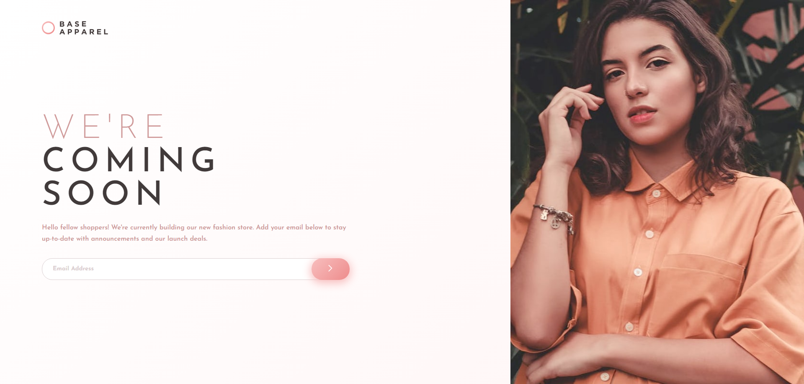
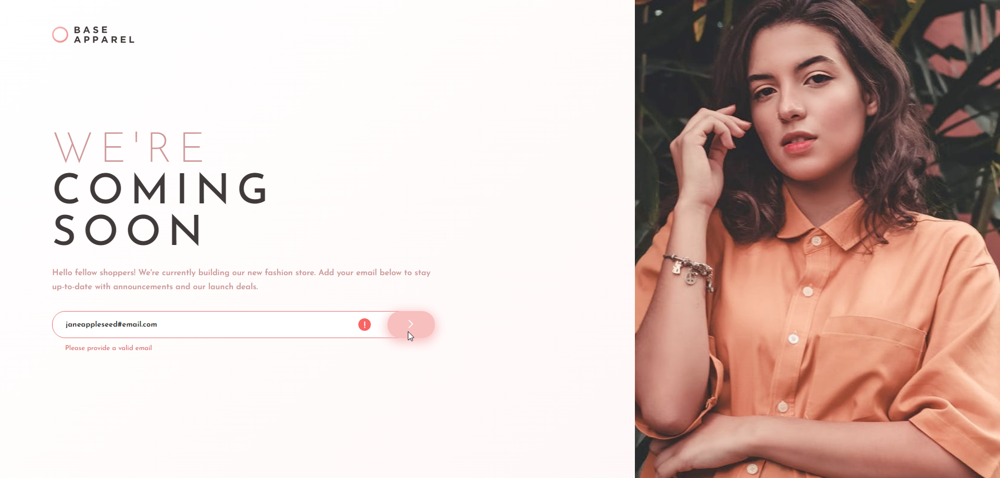
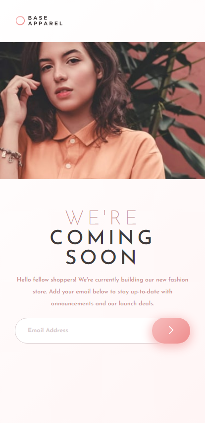

# Frontend Mentor - Base Apparel coming soon page solution

This is a solution to the [Base Apparel coming soon page challenge on Frontend Mentor](https://www.frontendmentor.io/challenges/base-apparel-coming-soon-page-5d46b47f8db8a7063f9331a0). Frontend Mentor challenges help you improve your coding skills by building realistic projects. 

## Table of contents

- [Overview](#overview)
  - [The challenge](#the-challenge)
  - [Screenshot](#screenshot)
  - [Links](#links)
- [My process](#my-process)
  - [Built with](#built-with)
  - [What I learned](#what-i-learned)
  - [Continued development](#continued-development)
  - [Useful resources](#useful-resources)
- [Author](#author)

**Note: Delete this note and update the table of contents based on what sections you keep.**

## Overview

### The challenge

Users should be able to:

- View the optimal layout for the site depending on their device's screen size
- See hover states for all interactive elements on the page
- Receive an error message when the `form` is submitted if:
  - The `input` field is empty
  - The email address is not formatted correctly

### Screenshot

Desktop

Mobile

### Links

- [Live Site URL](https://base-apparel-ianwilk20.netlify.app/design/index.html)

## My process

### Built with

- Semantic HTML5 markup
- CSS custom properties
- Flexbox

### What I learned

- I was unsure if the "We're" part of "We're coming soon" should be it's own h1 tag and "coming soon" it's own h1 tag. [I learned that for SEO reasons](https://stackoverflow.com/questions/31499185/two-different-styles-in-the-same-h1-tag), which don't necessarily matter for the sake of the challenge but for best practice sake, to have two spans in the same h1 tag.

- I found it very difficult make this site responsive because the hero would resize oddly when reducing the window size. To make things more challenging, the mobile layout had the hero image between the brand logo and the body text, but the desktop layout had the brand logo top left, the body text underneath and the hero image full height floating to the right. I learned that designing a site for desktop first then mobile is challenging and that it is suggested to go the other way around: mobile then desktop.

- Combining the input element's pattern and attaching an event listener to the input element proved effective at detecting valid emails. There are many complicated regex patterns to detect valid emails, but I followed suit with [this Stack Overflow](https://stackoverflow.com/a/36379040) comment that suggested one that takes into account universal email rules (an email that contains at least one non "@" character  before the "@", the "@", another character, a dot, and a final character).

### Continued development

I think the afformentioned difficulty with responsivity could have also been avoided had I used a grid layout. I will read into the basics of the grid layout as I've come to learn that knowing Flexbox and grid will cover most, if not all, use cases.

### Useful resources

- [A complete guide to Flexbox](https://css-tricks.com/snippets/css/a-guide-to-flexbox/) - This helped me better understand how to use Flexbox.
- [A practial guide to responsive web design](https://www.youtube.com/watch?v=x4u1yp3Msao&t=525s) - This is an amazing video which caught me up to speed on how to design responsive sites (after I endured much difficulty with this one), and I wish I would have come across it sooner.

## Author

- GitHub - [ianwilk20](https://github.com/ianwilk20)